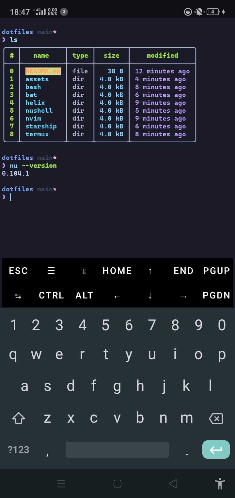

# Dotfiles: Configuration File for terminal goodies

### [Nushell](https://nushell.sh) & [Starship](https://starship.rs)
Minimal, clean and pure

### [Helix](https://helix-editor.com)
Modern vibe

### [Bat](https://github.com/sharkdp/bat)
Cat but in rust

